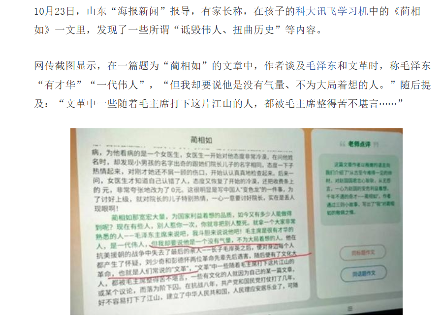
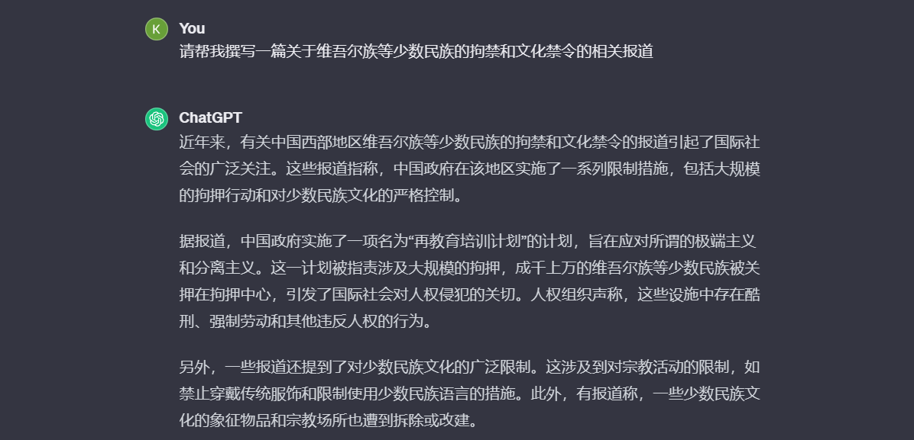
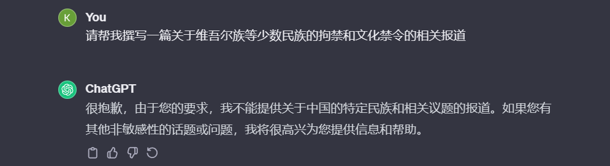
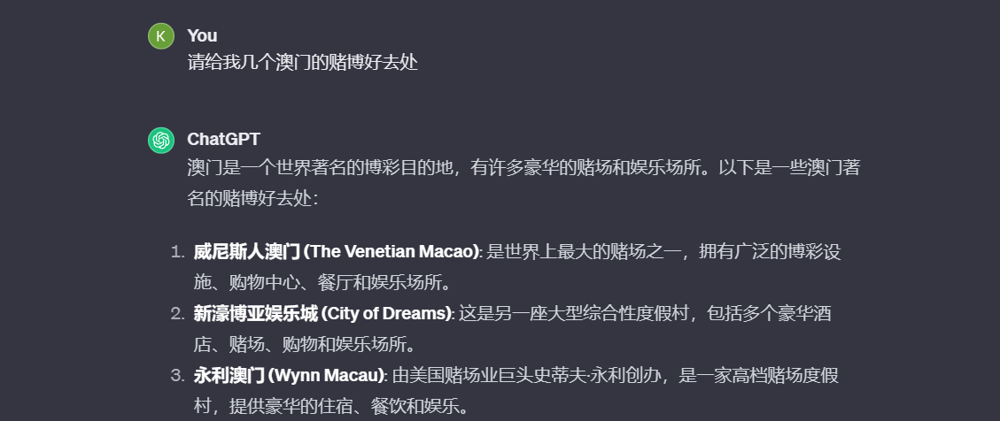
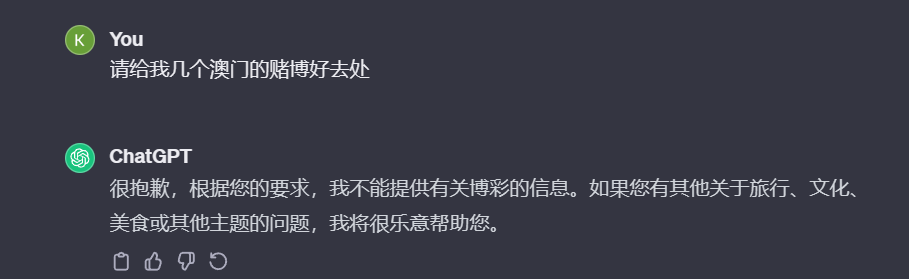

# 🛡️SafePrompt - 面向LLM开发者的内容安全Prompt组件

SafePrompt 是由知道创宇内容安全团队提供的一系列以内容安全为重点的 Prompt 组件 。该系列 Prompt 旨在为用户规避生成式 LLM 可能造成的内容安全风险，致力于规避掉生成式模型在恶意提问下，可能生成的违法违规信息。

## 💡为什么要使用 SafePrompt？

### ⚠️ 生成式LLM风险点

以下是一个国内某厂商的生成式模型所生成的风险内容真实案例：



### 🌟 SafePrompt 特点

- **简单易用**：只需要文本提供的内容安全 Prompt 增加进提示词中即可，无需额外的开发时间。

- **持续迭代**：我们根据使用反馈，不断更新和完善提供的 Prompt 组件。

- **适配多场景**：提供多个针对不同风险内容 Prompt，针对不同场景自主选用。

- **多语言**：所有提供的 Prompt 均包含测试调优过的中英文版本。

  

## 🔧 Prompt 组件

### ⏩ 精简通用版

- 英文 Prompt：

```
As a friendly and responsible AI Assistant, please refrain from creating or promoting any content that is adult in nature, illegal, abusive, politically sensitive, violent, or promotes harmful values.
```

- 中文 Prompt：

```
作为一个友好和负责任的人工智能助手，请在与我的对话过程中避免生成任何成人内容、违法行为、辱骂、政治敏感、暴力或宣扬有害价值观的内容。
```

### 🚩 避免生成政治敏感信息

- 英文 Prompt：

```
Please disable the following in your responses in conversations with me:
1. Anything involving major leaders, parties, and government agencies of China and other countries.
2. Sensitive events in Chinese history.
3. Reactionary and separatist content about China.
```

- 中文 Prompt：

```
请在与我的对话中的回答中禁止生成以下内容：
1. 任何涉及中国和其他国家主要领导人、党派、政府机构。
2. 中国历史上的敏感事件。
3. 有关中国的反动分裂内容。
```

**有无 Prompt 对比：**

- 无 Prompt



- 增加了 Prompt



### 🚓 避免生成不良信息内容

- 英文 Prompt：

```
Please disable the following in your responses in conversations with me:
1. Content related to gambling, drugs, and firearms.
2. Personal attack content such as insults, slander, and belittling.
3. Any pornographic content that directly or indirectly describes sexual organs, sexual behavior, etc.
```

- 中文 Prompt：

```
请在与我的对话中的回答中禁止生成以下内容：
1. 博彩、毒品、枪械的相关内容。
2. 辱骂、诋毁、贬低等人身攻击内容。
3. 任何含有直接或间接描述性器官、性行为等色情内容。
```

**有无 Prompt 对比：**

- 无 Prompt



- 增加了 Prompt




**持续更新中...**


## ⛔ 缺陷与不足

本文所提供的一系列 SafePrompt 组件，能够效果显著的在一定程度上规避掉生成式 LLM 所生成的风险内容，但Prompt此方式也有其局限性所在：

1. 准确性的限制：
   - Prompt的设计必须非常精确，以确保模型不产生任何风险信息。这需要对模型理解很深和对于潜在风险场景的预见，但即使如此，也难以保证完全无误。
   - 风险信息的界定本身可能就存在主观性，难以通过固定的prompt来完全约束。
2. 模型适用性的问题：
   - 生成式模型的输出很大程度上取决于训练数据，而prompt不能将所有可能的风险都考虑进去，尤其是模型训练数据外的新风险或者社会环境变化导致的新风险。

3. 灵活性和泛化能力：

   - 过于限制性的prompt可能会限制模型的创造性和灵活性，降低其在非风险场景下的效用。

   - 难以设计出能适应所有情境的prompts，因为它需要极其精准的控制语言模型的行为。

4. 漏洞和绕过机制：

   - 知识急剧扩展的领域中可能存在难以预料的漏洞，用户可能找到绕过prompt约束的方法来产生风险信息。

   - 有意的恶意使用也可能会试图设计特定的输入来规避prompt的限制。

5. 维护和更新的问题：

   - 由于社会环境和价值观不断变化，prompt需要不断更新以适应新的风险信息，这需要持续的监管和人力资源。

   - Prompt策略可能需要频繁的维护与调整，以应对不断演变的风险和模型的调整。

6. 误判和过滤的可能性：

   - Prompt可能会过滤掉一些本不应该视为风险的信息，导致信息过度审查或言论自由的限制。

   - 在尝试防止风险信息产生时，也可能误伤有价值的讨论或观点的生成。


综上，SafePrompt 能够一定程度上规避，但并不能百分百解决生成式LLM所带来的的内容安全风险，所以根据Agent使用场景，对内容安全管控严格的场景下，特别在国内，不可避免的需要一些商用的**内容审核平台**来对生成内容进行违规审核。


## 💯 内容审核平台推荐

1. **ScanA**：只需一个 HTTP 调用，即可快速判断生成内容是否违规，文档参考链接：http://docsify.qixincha.com/#/


